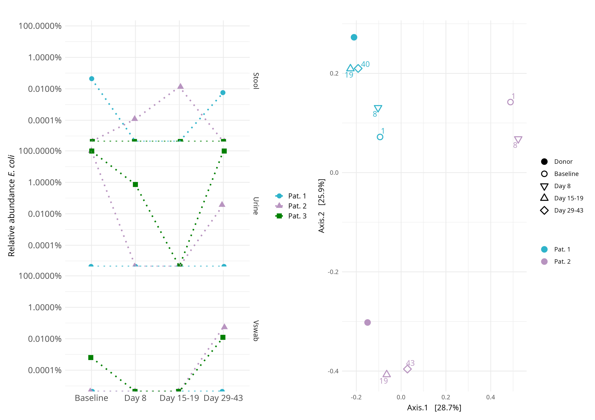

# MirUTI — Figure 9

R code that reproduces **Figure 9** of:

> *Bacteriophage therapy plus fecal microbiota transplantation to treat recurrent urinary tract infection (a case series).*

The figure has two panels:

- **9A** — Relative abundance of *Escherichia coli* across stool, urine, and vaginal swab samples over the treatment timeline, for each of the three patients.
- **9B** — Bray–Curtis PCoA of the recipient stool samples (Pat. 1, Pat. 2), with sample timepoints distinguished by point shape.



## Repository layout

```
.
├── import_metaphlan_results_and_make_figures.R        # single script: helpers + import + both panels
├── data/
│   ├── merged_abundance_table1.tsv  # MetaPhlAn abundances, cohort 1
│   ├── merged_abundance_table2.tsv  # MetaPhlAn abundances, cohort 2
│   ├── attributes_table.tsv         # sample metadata
│   └── seq_days.xlsx                # per-sample timepoint info
├── tmp/                       # output directory (PDF + adonis/anosim stats)
└── fig9.jpeg                  # the assembled figure as published
```

## Requirements

R (≥ 4.2) with the following CRAN/Bioconductor packages:

```r
install.packages(c("tidyverse", "vegan", "ggpubr", "patchwork",
                   "ggrepel", "readxl", "scales"))

# Bioconductor
if (!require("BiocManager")) install.packages("BiocManager")
BiocManager::install(c("phyloseq", "microbiome", "GUniFrac"))
```

All helper functions (`aggregate_topn`, `myotudf`, `myadonis2`, `mypcoa`,
`metaphlanToPhyloseq`) are defined inline — nothing else needs to be sourced.

## Running

From the repo root:

```bash
Rscript import_metaphlan_results_and_make_figures.R 
```

Or interactively:

```r
source("import_metaphlan_results_and_make_figures.R")
fig7a   # E. coli abundance panel
fig7b   # PCoA panel
```

The PCoA call also writes a PDF and the corresponding adonis2/ANOSIM
statistics into `./tmp/`.

## Inputs

| File | Contents |
|------|----------|
| `data/merged_abundance_table1.tsv` | MetaPhlAn4 merged abundance table, cohort 1 (sample IDs `BM…`) |
| `data/merged_abundance_table2.tsv` | MetaPhlAn4 merged abundance table, cohort 2 (sample IDs `CH…`) |
| `data/attributes_table.tsv`        | Sample metadata: patient, body site (`env_local_scale`), timepoint |
| `data/seq_days.xlsx`               | Day offsets keyed by `SeqID` |

The two abundance tables are imported and merged into a single `phyloseq`
object; sample-level metadata is joined onto it via `sample_data()`.

## Outputs

Written to `./tmp/`:

- `…_bray_PCoA.pdf` — the raw PCoA figure produced by `mypcoa()`.
- `…_bray_stat.txt` — adonis2 model and per-group sample counts.

The two ggplot objects (`fig7a`, `fig7b`) remain in the R session for
further composition (e.g. via **patchwork**) into the published Figure 9.

## Citation

If you use this code, please cite the paper above.
